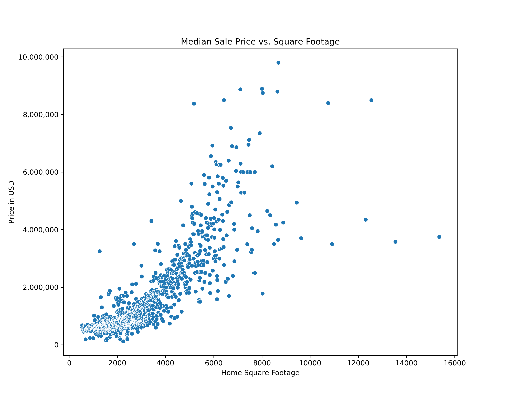
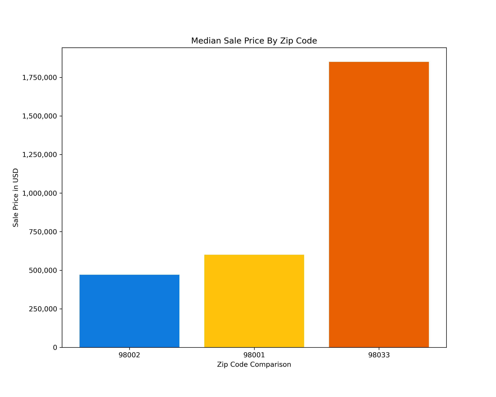
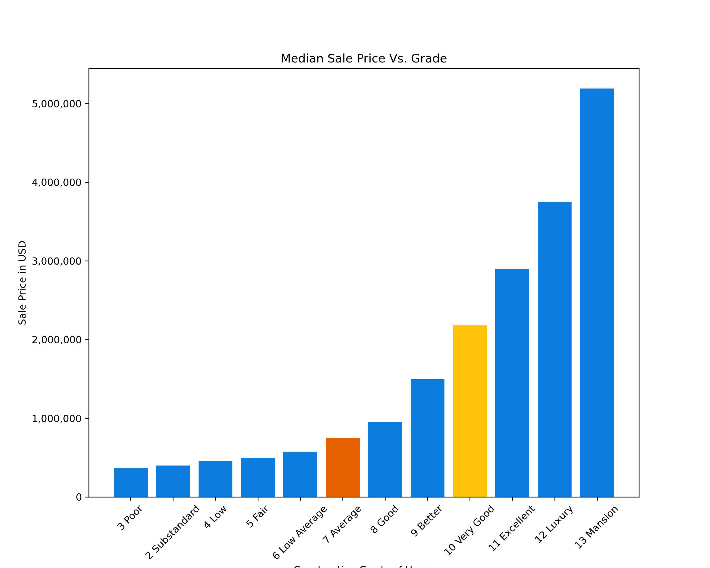

# King County Residential Real Estate Anlaysis


**Author**:

Clara Giurgi
Stephanie Ciaccia

## Overview

Panda Real Estate is a residential real estate firm that prioritizes leveraging technology to enhance and optimize their real estate portfolio. Historically operating in the greater New York City Area, Panda Real Estate has decided to expand it's portfolio to the west cost, to include properties in King County, Washington.

## Business Problem


As Panda Real Estate expands it's market to the greater Seattle Metropolitan area, we will be identifying the key variables that influence residential home prices in King County, Washington. By conducting a thorough exploration of the various variables that can impact home prices to ensure a comprehensive analysis of potential investment properties, we help inform investment teams on the residential housing market.

## Data

-**King County Data** We used a dataset from [King County Open Data](https://gis-kingcounty.opendata.arcgis.com/) that includes over 30K home sales from 2021-2022. Variables inlcuded in this dataset include a variety of physical and environmental variables such as:

-**FRED Economic Data** This dataset was pulled from [Economic Research - Federal Reserve Bank of St. Louis](https://fred.stlouisfed.org/series/MORTGAGE30US). In includes monthly mortage rates from the past 30 years.

## Methods

To perform our inferential analysis, we created a multiple linear regression. This model was used to examine the relationship between the price, our dependent variable, and a variety of independent variables.

## Results

- **Home Size**



- **Proximity to Seattle**



- **Construction grade quality.**




## Conclusions

As a result of this analysis, three variables have been identified that can impact prices and should be taken into consideration when researching potential investment properties:

- **Home Size** There is a direct correlation between the sq. ft. of the home and the sale price. Larger homes have higher sale prices.
- **Proximity to Seattle** Homes closer to Seattle have higher sale prices.
- **Construction grade quality.** Lower construction quality is associated with a decrease in sale price.

### Next Steps
To gain a more comprehensive understanding of changing home prices, it would be beneficial to analyze additional historical home sale data beyond the current dataset that only spans 18 months. Reviewing home sales over the past 5-10 years can provide insights into how the housing market has evolved.

In addition to historical data, conducting further analyses of environmental variables can enhance our understanding of residential home prices and should be taken into consideration. Some factors to consider include:

- School district ratings and locations
- Tax data
- Population data

## For More Information

See the full analysis in the [Jupyter Notebook]

## Repository Structure

```
├── code
│   ├── 
│   ├── 
│   ├── 
│   └── 
├── data
├── images
├── __init__.py
├── README.md
├── Presentation.pdf
└── Final_Kings_County_Analysis.ipynb
